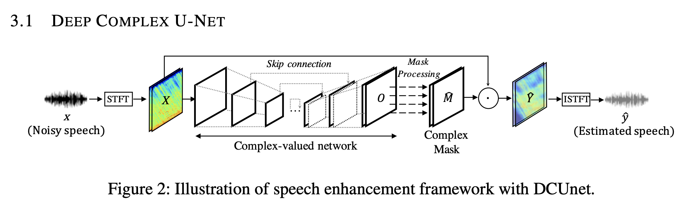

# Introudction
Impelmentation Phase-aware Speech Enhnacement Deep Complex UNet  
This is convolution neural networks model for Speech Enhancement  
Papers URL
1. [Phase-aware Speech Enhancement Deep Complex UNet - openreview](https://openreview.net/pdf?id=SkeRTsAcYm)
2. [Phase-aware Speech Enhancement Deep Complex UNet - arxiv](https://arxiv.org/abs/1903.03107)
## Architecture

#
# Requirements
Python >= 3.6.9 (3.7.6)  
numpy  
scipy  
librosa 0.7.2  (with numba 0.48.0)  
Tensorflow >= 2.1.0  
#  
# Directory  
```
Directory
./Deep_Complex_UNet
    /datasets
        /train_noisy
        /train_clean
        /test_noisy
        /test_clean
    /model_save
    /model_pred
    /complex_layers
        __init__.py
        STFT.py
        networks.py
        activation.py
        normaliztion.py
    model.py
    model_module.py
    model_loss.py
    model_data.py
    model_test.py
    model_train.py
```
#
# Usage
```
--model naive_dcunet16 naive_dcunet20 dcunet16 dcunet20
--loss SDR or wSDR  
--save "save file name"  
python model_train.py --model dcunet20 --loss wSDR --save dcunet20_default --optim adam --lr 0.002
python model_train.py --model dcunet16 --loss wSDR --save dcunet16_default --optim adam --lr 0.002
```